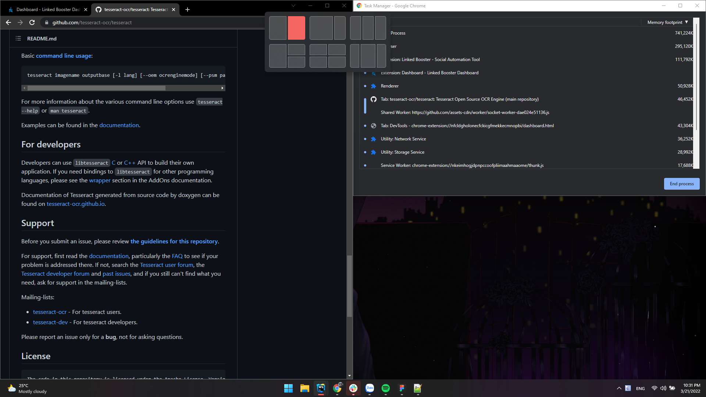
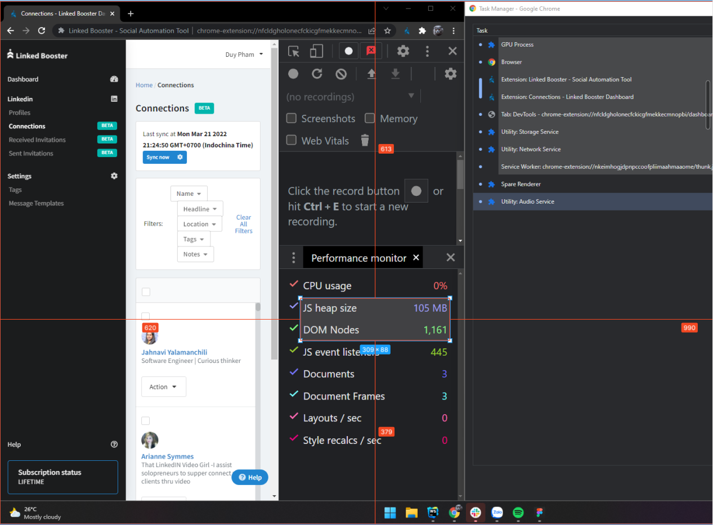
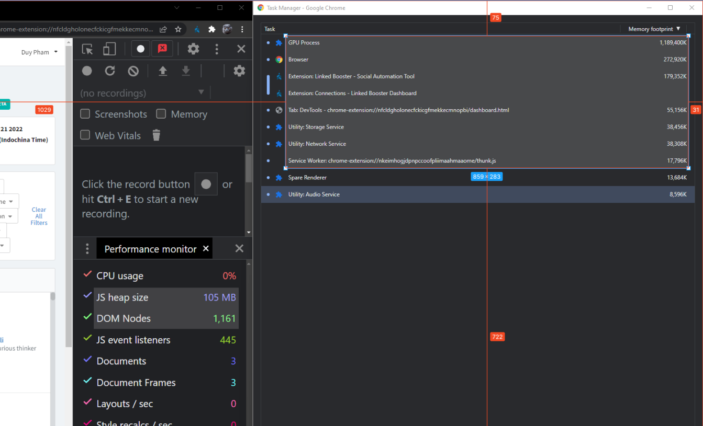
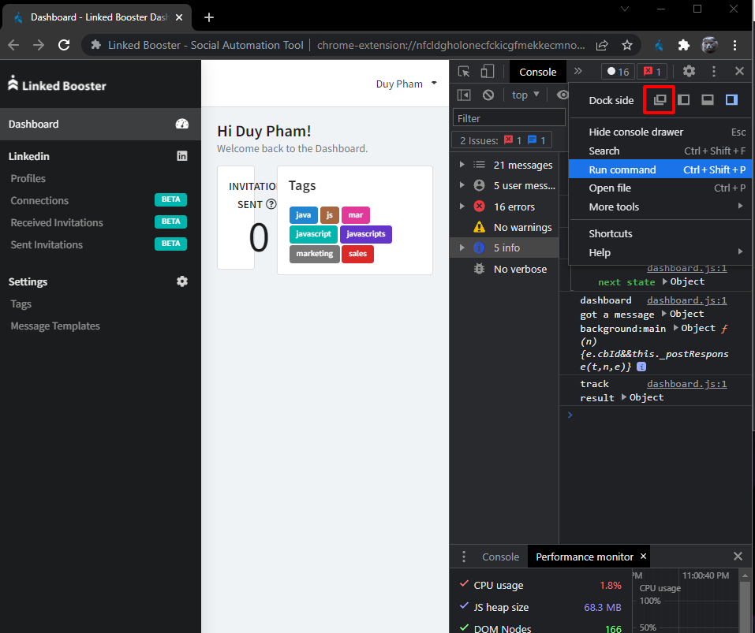
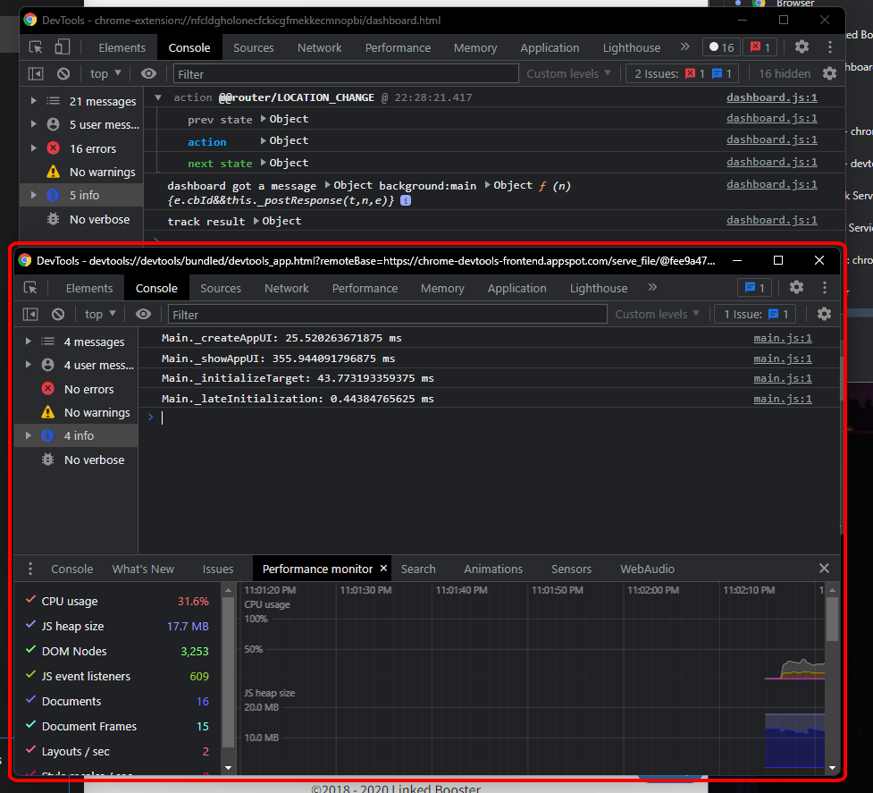

# Autocapture With OCR

Make Linked Booster benchmarking less painful

This helps:

1. Capture screen at specific regions with interval
2. Read texts from screenshots with OCR
3. Extract benchmark values from OCR-ed text

Built with:

- [Tesseract.js](https://tesseract.projectnaptha.com/): OCR module using AI
- [sharp](https://sharp.pixelplumbing.com/): Used for image processing to help Tesseract read image with higher
  accuracy

## I. Prerequisites

- Node 14+
- Python 3.8
- Windows OS

## II. Installation

Open Terminal, run:

```javascript
npm install -g node-gyp
npm install -g windows-build-tools
```

Open project root folder, run:

```javascript
yarn install
```

## III. Commands

`*` mean `required`

### 1. Capture screen at specific regions with interval

#### Command

```javascript
node screen-capture.js
```

#### Parameters

| Params          | Description                        | Value                                                          |
| :-------------- | :--------------------------------- | :------------------------------------------------------------- |
| dashboard \*    | Coordinates of Dashboard region    | [left]-[top]-[width]-[height]                                  |
| task-manager \* | Coordinates of Task Manager region | [left]-[top]-[width]-[height]                                  |
| namespace \*    | Snapshots Output folder            | Differentiate different captures                               |
| interval        | Snapshots Output folder            | Waiting time between captures, in miliseconds. Default: `1000` |

#### Example:

```javascript
node screen-capture.js
```

### 2. Read texts from snapshots with OCR

#### Command

```javascript
node extract-texts.js --namespace [name of your capture]
```

#### Parameters

| Params       | Description                                | Value                       |
| :----------- | :----------------------------------------- | :-------------------------- |
| namespace \* | Name of the capture do you want to analyze | Capture name: Ex: capture_1 |

#### Example:

```javascript
node extract-texts.js
```

### 3. Extract benchmark values from OCR-ed text

#### Command

```javascript
node benchmark.js
```

#### Parameters

| Params        | Description                                                                                                                                           | Value                       |
| :------------ | :---------------------------------------------------------------------------------------------------------------------------------------------------- | :-------------------------- |
| namespace \*  | Name of the capture do you want to analyze                                                                                                            | Capture name: Ex: capture_1 |
| batch-size \* | The tool process images in batch. Higher batch will slightly reduce processing time (about 5 - 10%) but more chance of unexpected error while running | Capture name: Ex: capture_1 |

#### Example:

```javascript
node extract-texts.js --namespace snapshots_1
```

## IV. Preparation for benchmarking

1. Open Chrome and Chrome Task Manager on **your Primary Display**, put them to equal grids like this
   
2. Use some image editing tools to find coordinates of the regions you want to capture. For example.
3. Dashboard region: `left: 620`, `top: 613`, `width: 309`, `height: 88`
   
4. Task manager region: `left: 1029`, `top: 75`, `width: 859`, `height: 283`
   
5. Open Extensions page and disable others extensions
6. Open Dashboard Devtools. Select display mode as floating windows
   
7. Focus on the floating Devtools and press Ctrl + Shift + I to open the root Devtools
   
8. Paste in this code into the Console and Enter. It will throttle CPU in half. Can customize throttling rate with the
   `rate` options

```javascript
let Main = await import('./devtools-frontend/front_end/entrypoints/main/main.js');
await Main.MainImpl.sendOverProtocol('Emulation.setCPUThrottlingRate', { rate: 2 });
```

## V. Start Benchmark

1. After arranging windows and identify capturing regions coordinates
2. Start terminal at root folder
3. Run [Command I](#capture-screen-at-specific-regions-with-interval) to capture. Ctrl + C to stop capturing
4. Run command [Command II](#read-texts-from-snapshots-with-ocr) with `--namespace` same as step 3
5. Run command [Command III](#extract-benchmark-values-from-ocr-ed-text) with `--namespace` same as step 3
6. The benchmark values will be logged to Terminal

## VI. Common Errors

### 1. createWorker Runtime error


#### Fix

Find the file with name: `eng.traineddata` in the root folder and delete it, then run the command again
